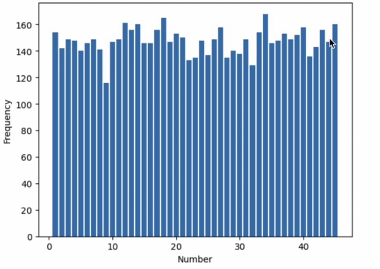

# Lotto

과거 로또 당첨 데이터를 바탕으로 간단한 학습용 모델을 만들고, 최신 회차 데이터 갱신, 번호 예측, Slack 알림까지 한 번에 실행할 수 있는 프로젝트입니다.



## 주요 기능

- 동행복권 API에서 최신 로또 회차 데이터 조회
- `data/lotto.csv` 기반 학습 데이터셋 생성
- `PyTorch`와 `MLflow`를 사용한 간단한 로또 예측 모델 학습
- 가장 최근 회차를 기준으로 다음 번호 예측
- 예측 결과 또는 임의 메시지를 Slack webhook으로 전송

## 개발 환경

- Python `3.12.10`
- `pyenv` 사용 권장

## 설치

```bash
python3 -m pip install -r requirements.txt
```

## 프로젝트 구조

```text
src/
  main.py
  utils/
    fetch_data.py
    lotto_model.py
    to_result.py
data/
  lotto.csv
requirements.txt
```

## 파일 설명

- [src/main.py](/Users/danielpark/개인토이/lotto/src/main.py): CLI 실행 진입점
- [src/utils/fetch_data.py](/Users/danielpark/개인토이/lotto/src/utils/fetch_data.py): 로또 데이터 수집, CSV 갱신, 데이터셋 생성, 원-핫 인코딩
- [src/utils/lotto_model.py](/Users/danielpark/개인토이/lotto/src/utils/lotto_model.py): `LottoMLP` 모델 정의와 학습 함수
- [src/utils/to_result.py](/Users/danielpark/개인토이/lotto/src/utils/to_result.py): 번호 예측과 Slack 전송 함수

## 실행 방법

### 1. 최신 로또 데이터 갱신

```bash
python3 src/main.py update-data
```

### 2. 모델 학습

```bash
python3 src/main.py train
```

### 3. 번호 예측

```bash
python3 src/main.py predict
```

### 4. Slack 메시지 전송

환경변수 사용:

```bash
export SLACK_URL="https://hooks.slack.com/services/..."
python3 src/main.py notify "로또 예측이 완료되었습니다."
```

또는 인자로 직접 전달:

```bash
python3 src/main.py notify "로또 예측이 완료되었습니다." --slack-url "https://hooks.slack.com/services/..."
```

## requirements

현재 `Python 3.12.10` 기준 `requirements.txt`는 아래 버전으로 고정되어 있습니다.

```txt
mlflow==3.12.0
numpy==2.4.5
pandas==2.3.3
requests==2.34.2
torch==2.12.0
```

## 참고

- `update-data`는 동행복권 API 응답 상태에 따라 실패할 수 있습니다.
- `predict` 실행 전에는 `train`으로 모델이 먼저 등록되어 있어야 합니다.
- `MLflow` 저장소 설정은 로컬 환경 설정에 따라 추가 구성이 필요할 수 있습니다.
